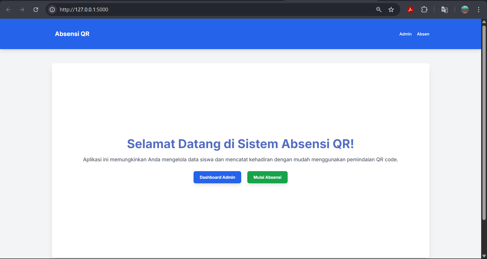

# Sistem Absensi QR Flask

Sistem Absensi QR Flask adalah aplikasi web absensi berbasis QR Code sederhana yang dibangun menggunakan **Python Flask** untuk backend dan **MySQL** sebagai database. Aplikasi ini dirancang untuk memudahkan manajemen data siswa dan pencatatan kehadiran secara efisien, cocok untuk sekolah, kursus, atau organisasi kecil.

---

## Tangkapan Layar Antarmuka Aplikasi

**Tampilan Awal**


**Dashboard Admin**


**Dashboard Tambah Data Mahasiswa**


**Dashboard Daftar Mahasiswa**


**Dashboard Data Absensi**


**Kamera Absen**


---

## Fitur Utama

### Dashboard Admin

* **Manajemen Siswa**: Menambah, melihat, dan menghapus data siswa.
* **Pembuatan QR Code Otomatis**: Setiap siswa yang ditambahkan akan otomatis digenerate QR Code unik.
* **Unduh QR Code**: QR Code siswa dapat diunduh untuk dicetak atau digunakan secara digital.
* **Riwayat Absensi**: Melihat catatan absensi siswa dengan filter tanggal, diperbarui secara real-time.
* **Hapus Absensi**: Admin dapat menghapus catatan absensi tertentu jika diperlukan.

### Pemindai Absensi (Sisi Klien)

* Mengakses kamera perangkat untuk memindai QR Code.
* Deteksi QR Code otomatis menggunakan **Instascan.js**.
* Menampilkan pop-up notifikasi nama siswa dengan status kehadiran selama sekitar 0.5 detik.
* Mencatat waktu dan tanggal absensi secara otomatis ke database.

---

## Teknologi yang Digunakan

* **Backend**: Python, Flask
* **Database**: MySQL
* **Frontend**: HTML, Tailwind CSS, JavaScript
* **Generasi QR Code**: `qrcode` (Python Library), `Pillow`
* **Konektor Database**: PyMySQL
* **Pemindaian QR**: Instascan.js (JavaScript Library)

---

## Struktur Proyek

```
qr_absensi_app/
├── app.py                  # Logika utama aplikasi Flask
├── config.py               # Konfigurasi database dan kunci rahasia
├── templates/              # File HTML (Jinja2 templates)
│   ├── base.html           # Template dasar untuk layout
│   ├── index.html          # Halaman utama
│   ├── admin_dashboard.html # Dashboard untuk admin
│   ├── add_student.html    # Form untuk menambah siswa baru
│   ├── student_list.html   # Daftar siswa dengan QR code & opsi unduh/hapus
│   ├── attendance_scanner.html # Halaman pemindai QR untuk absensi
│   └── attendance_records.html # Riwayat absensi dengan filter & real-time update
├── static/                 # File statis (CSS, JS, Gambar)
│   ├── css/
│   │   └── style.css       # CSS kustom (saat ini minimal, Tailwind dominant)
│   ├── js/
│   │   ├── main.js         # Logika JavaScript untuk pemindai QR
│   │   └── attendance_records.js # Logika JS untuk real-time update absensi
│   └── qr_codes/           # Folder untuk menyimpan gambar QR code yang digenerate
├── requirements.txt        # Daftar pustaka Python yang dibutuhkan
└── README.md               # File ini!
```

---

## Persyaratan Sistem

* Python 3.6+
* Server MySQL
* Browser web modern (Chrome, Firefox, Edge) dengan izin kamera

---

## Panduan Instalasi dan Menjalankan Aplikasi

### 1. Klon Repositori

Jika menggunakan GitHub:

```bash
git clone <URL_REPOSITORI_ANDA>
cd qr_absensi_app
```

### 2. Instal Dependensi Python

```bash
pip install -r requirements.txt
```

### 3. Konfigurasi Database MySQL

Pastikan MySQL berjalan, lalu buat database dan tabel:

```sql
CREATE DATABASE qr_absensi;
USE qr_absensi;

CREATE TABLE siswa (
    id INT AUTO_INCREMENT PRIMARY KEY,
    nama VARCHAR(100) NOT NULL,
    nis VARCHAR(50) NOT NULL UNIQUE
);

CREATE TABLE absen (
    id INT AUTO_INCREMENT PRIMARY KEY,
    siswa_id INT NOT NULL,
    waktu DATETIME NOT NULL,
    FOREIGN KEY (siswa_id) REFERENCES siswa(id)
);
```

Perbarui kredensial di `config.py`:

```python
class Config:
    SECRET_KEY = 'super_secret_key_anda'
    MYSQL_HOST = 'localhost'
    MYSQL_USER = 'root'
    MYSQL_PASSWORD = ''
    MYSQL_DB = 'qr_absensi'
```

### 4. Jalankan Aplikasi Flask

```bash
python app.py
```

Akses aplikasi di: [http://127.0.0.1:5000](http://127.0.0.1:5000)

### 5. Halaman Absensi Kamera

[http://127.0.0.1:5000/absen](http://127.0.0.1:5000/absen)


---

## Kontribusi

Kontribusi sangat disambut! Silakan buat issue atau pull request jika menemukan bug atau punya saran.

---
